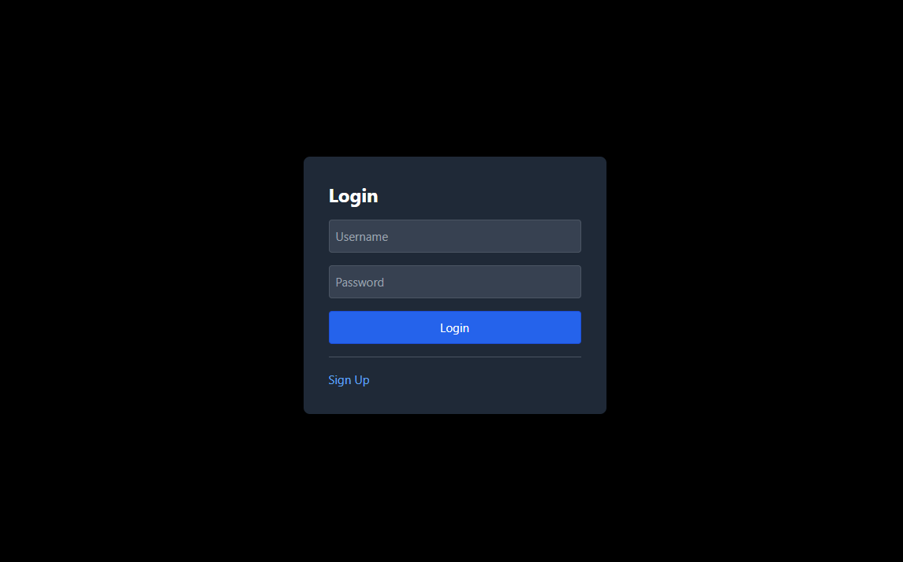
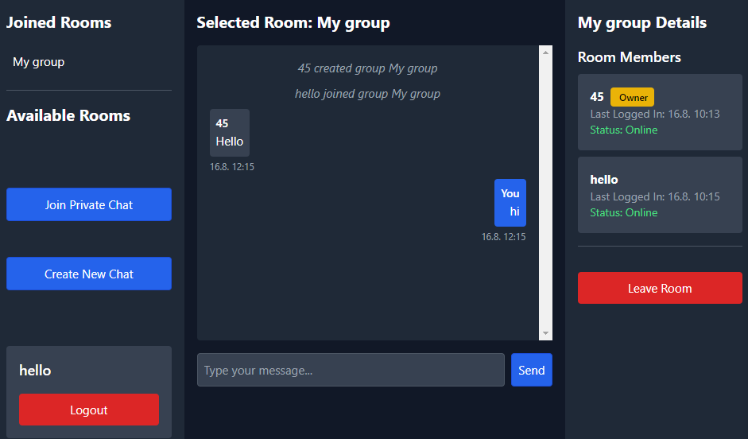
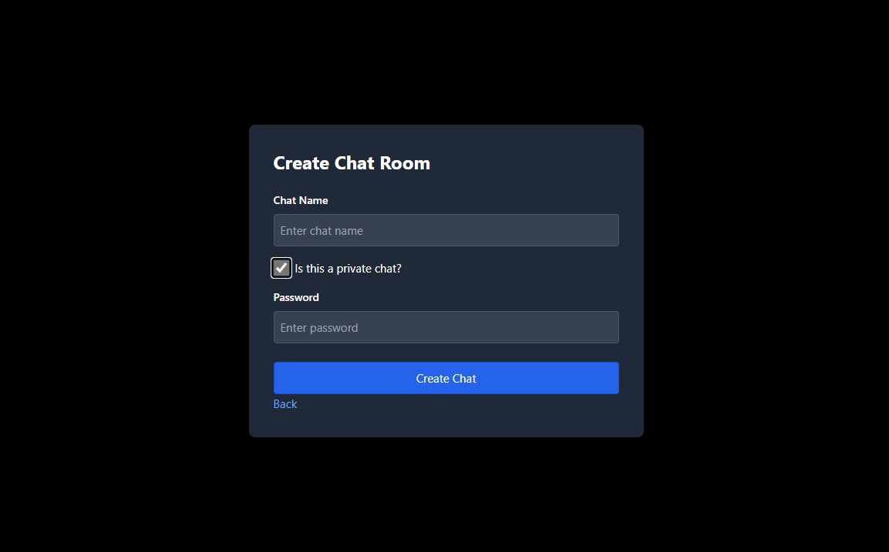

# Chat App

## Features:
- User authentication (signup & login)
- Public rooms
- Private rooms (password)
- Realtime chat

## Tech Stack:

### Front end:
- VUE.js
- TypeScript

### Back end:
- NodeJS express app
- Sockets
- Postgres (DB)

## Gallery:
Login page 

Chat page 

Create page 
